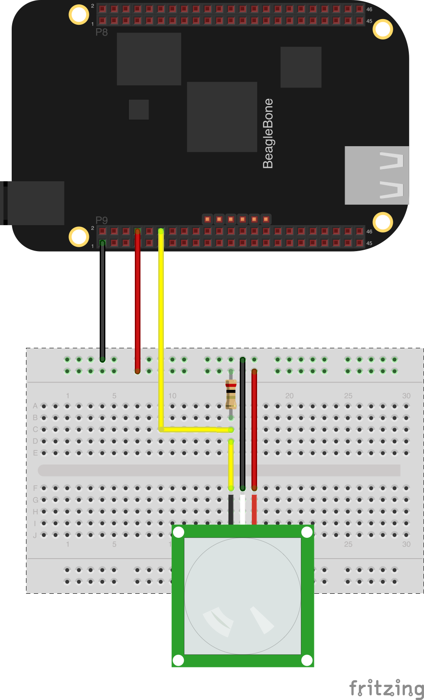

##Monitor a PIR Sensor using Zetta and bonescript!

###Install

```
$> npm install zetta-pir-bonescript-driver
```

###Usage

```
var zetta = require('zetta');
var PIR = require('zetta-pir-bonescript-driver');

zetta()
  .use(PIR, 'P9_12')
  .listen(1337)
```

### Hardware

* [Beagle Bone](http://beagleboard.org/black)
* [PIR Motion Sensor](https://www.sparkfun.com/products/8630)
* 10K Resistor


